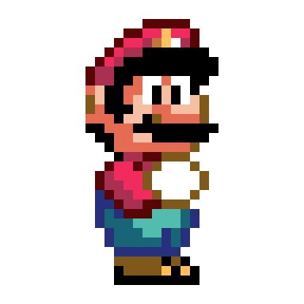
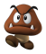

<p align="center">
  
</p>

<h1 align="center">Super Mario — Multithreaded Game</h1>

<p align="center">
  A Super Mario–style runner where <strong>every enemy lives on its own thread</strong>.<br>
  Built as a <strong>Parallel &amp; Distributed Computing</strong> lab project to demonstrate
  multithreading, concurrency and critical-section handling.
</p>


## Overview

This is a small 2D running game inspired by Super Mario. The player controls Mario as he
runs and jumps through a level full of enemies (Goombas). The goal is simple: survive,
defeat enemies, and avoid getting hit head-on.

What makes this a *parallel and distributed* project rather than a plain game is its design:
**each moving entity is an independent thread**. Mario runs on one thread, and every enemy
runs on its own thread, all executing concurrently. As a result, the interesting problems —
collisions, shared state, and pausing — become concurrency problems, and the project solves
them with thread synchronization and a critical-section strategy.

## Gameplay

Mario starts on the left and moves right across the level while enemies patrol toward him:

- Touch an enemy **head-on** → **Game Over**.
- Land on an enemy **from above** (by jumping) → the enemy is **defeated**.
- Defeat **9 enemies** → **You win**.

A live counter in the HUD tracks how many enemies you have defeated.

## Concurrency & Synchronization

This is the core of the project.

- **One thread per entity.** Mario and each enemy run on separate threads and move in
  parallel, independently of one another.
- **Collision ends a thread.** When Mario jumps on an enemy, the collision is detected, the
  enemy is removed, and its thread terminates cleanly.
- **Critical section between enemies.** Two enemy threads can also collide with *each other*.
  That shared interaction is a critical section: handled naively, the game could mistake it
  for the player dying or leave the world in an inconsistent state. The project resolves the
  contention by removing one of the two colliding enemies, keeping state consistent.
- **Identity-based collision detection.** Every entity carries an identifier. The collision
  logic uses these IDs to tell a *player–enemy* collision (which can end the game) apart from
  an *enemy–enemy* collision (which never does). Two entities of the same kind can never
  trigger a Game Over against each other.
- **Global pause.** Pressing `P` suspends every thread at once — Mario and all enemies —
  freezing the entire game state in place until the game is resumed.
- **Shared score counter.** Each defeat (whether by a jump or by an enemy–enemy collision)
  increments a shared counter; reaching 9 triggers the win condition.

<p align="center">
  
</p>
<p align="center"><em>Two enemy threads meeting — the critical section the game has to resolve.</em></p>

## Features

- Real-time keyboard control: run and jump
- Multiple enemies, each on its own thread, moving concurrently
- Jump-to-defeat mechanic with proper thread cleanup
- Enemy-vs-enemy collision resolution
- Global pause / resume that freezes every thread
- Live "enemies defeated" counter in the HUD
- Win screen at 9 defeats, Game Over on a head-on hit
- Start a fresh game at any time

## Controls

| Key | Action |
| --- | --- |
| `→` Right arrow | Move right |
| `←` Left arrow | Move left |
| `Space` | Jump |
| `P` | Pause / resume |
| `N` | New game |

## Screenshots

| Pause | Game Over | Winner |
| :---: | :---: | :---: |


## Getting Started

> **Note on the stack:** the steps below assume the game is written in **Java (Swing/AWT)**,
> which is the usual setup for this kind of project. If you used a different language or
> framework, adjust the build and run commands to match.

### Prerequisites

- Java JDK 8 or newer — check with `java -version`

### Clone

```bash
git clone https://github.com/<your-username>/<repo-name>.git
cd <repo-name>
```

### Run

**From an IDE (recommended):** open the project in IntelliJ IDEA or Eclipse and run the main class.

**From the command line:**

```bash
# compile (adjust the source path to match your project)
javac -d out src/*.java

# run (replace Main with the name of your entry-point class)
java -cp out Main
```

## Project Structure

```
.
├── src/            # game source code
├── screenshots/    # images used in this README
├── assets/         # logo and other assets
└── README.md
```

*Adjust the tree above to match your actual layout.*

## Author

**Yoni Benarous**
Parallel & Distributed Computing — lab project.

## Notes

Mario, Goomba and related characters are trademarks of Nintendo. This is a non-commercial
project made for educational purposes only; all original sprites and assets belong to their
respective owners.
